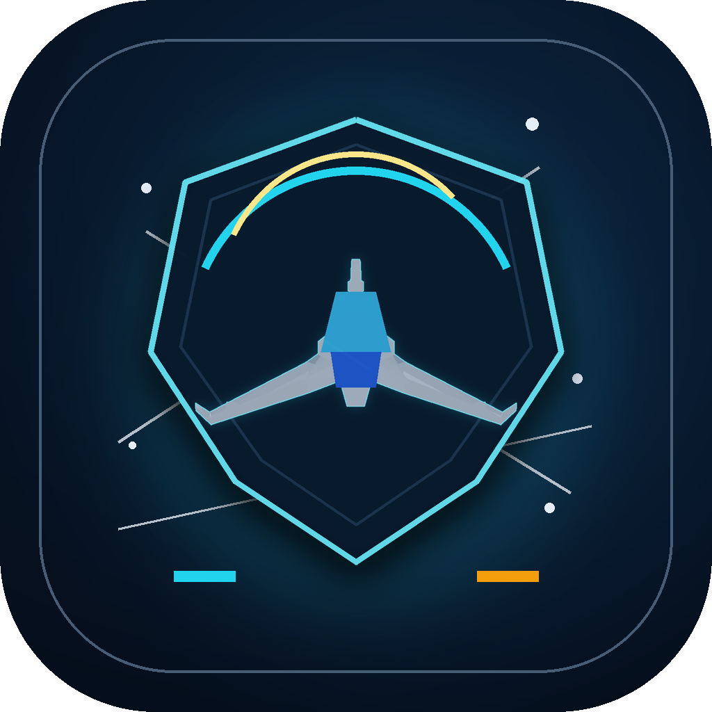
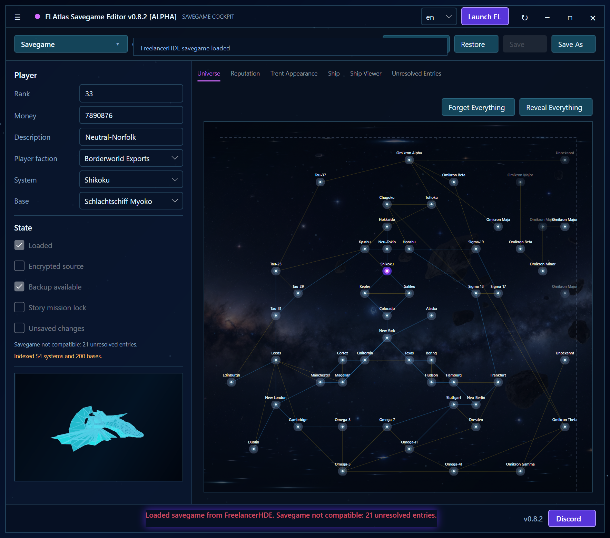
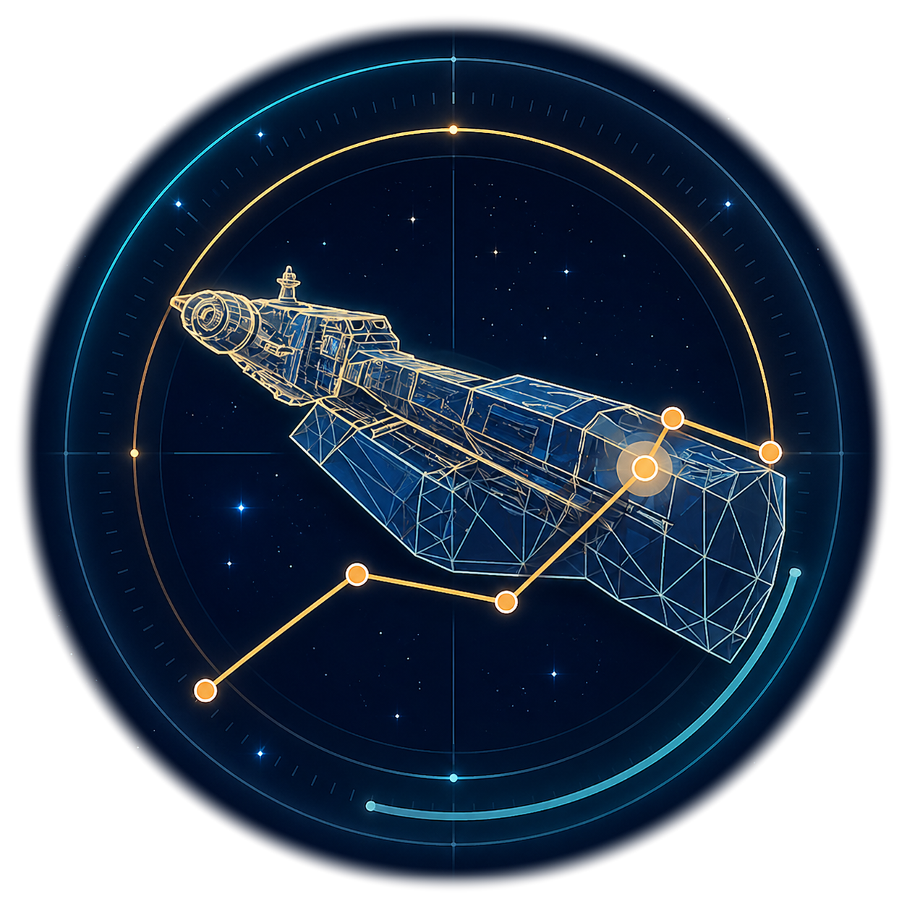
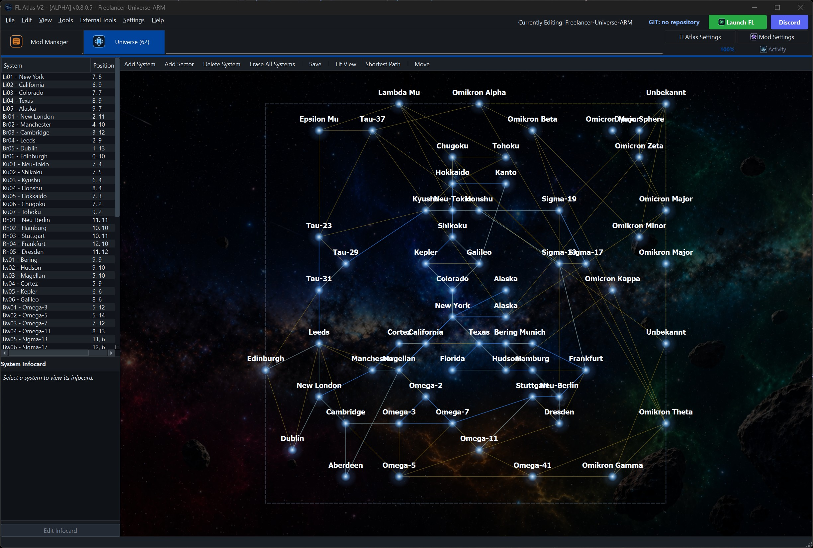
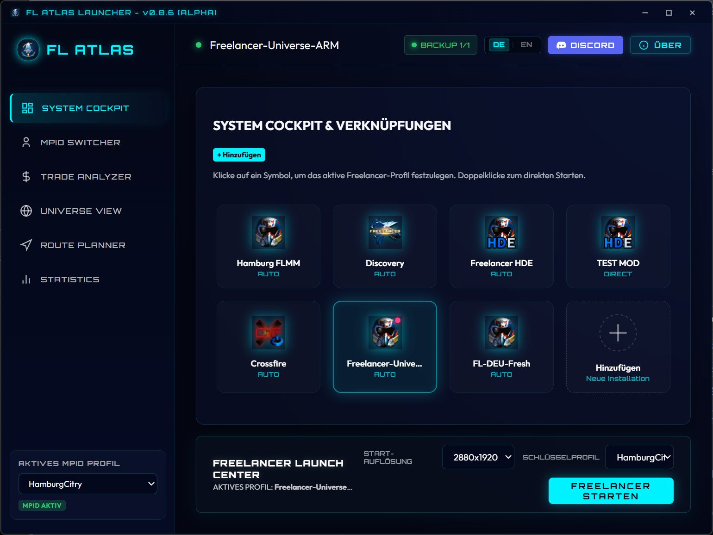

<h1 align="center">flathack</h1>

  <strong>Freelancer modding tools, desktop companions, and savegame editors for pilots, modders, and server creators.</strong>

  
  
  

  <a href="#english-version">English</a>
  |
  <a href="#deutsche-version">Deutsch</a>
  |
  <a href="#russian-version">Русский</a>

---

## English Version

Welcome to **flathack**. I build user-focused tools for **Microsoft Freelancer**, with an emphasis on safer save editing, mod-aware data handling, visual universe tooling, and practical desktop workflows.

### Featured Projects

####  [FLAtlas Savegame Editor](https://github.com/flathack/FLAtlas---Save-Game-Editor)

> A modern, mod-aware Freelancer singleplayer savegame editor with backups, validation, encrypted-save support, game-data lookup, and a cockpit-style UI.

  
  
  

  

- Edit credits, rank, description, player faction, current system, base, reputation, Trent appearance, ship equipment, cargo, and discovered universe state.
- Resolve names from vanilla Freelancer, Freelancer HD Edition, and modded installations.
- Preserve encrypted `FLS1` savegames and unknown save rows where possible.
- Keep backups and validation warnings visible before risky writes.

Explore: [Repository](https://github.com/flathack/FLAtlas---Save-Game-Editor) | [Download v0.8.4](https://github.com/flathack/FLAtlas---Save-Game-Editor/releases/tag/v0.8.4) | [Russian README](https://github.com/flathack/FLAtlas---Save-Game-Editor/blob/main/README.ru.md) | [ModDB Mirror](https://www.moddb.com/games/freelancer/downloads/flatlas-savegame-editor)

####  [FLAtlas-V2](https://github.com/flathack/FLAtlas-V2)

> Native Freelancer universe and visual system tooling for complex modding workflows around systems, bases, trade lanes, jump gates, jump holes, and map layouts.

  

- Render and inspect Freelancer universe structures visually.
- Process large mod data sets such as HD Edition, Discovery, Genesis, and other total-conversion style projects.
- Validate system layouts, universe coordinates, and connection networks.

Explore: [FLAtlas-V2](https://github.com/flathack/FLAtlas-V2) | [German README](https://github.com/flathack/FLAtlas-V2/blob/master/README.de.md) | [Russian README](https://github.com/flathack/FLAtlas-V2/blob/master/README.ru.md)

####  [FLAtlas Launcher](https://github.com/flathack/FL-Atlas-Launcher)

> Desktop launcher for organizing Freelancer installations, active mods, multiplayer IDs, and companion tools.

  

- Manage multiple Freelancer installs or mod profiles.
- Configure launch paths and player profile data.
- Start Freelancer and related FLAtlas tools from one place.

Explore: [FLAtlas Launcher](https://github.com/flathack/FL-Atlas-Launcher) | [German README](https://github.com/flathack/FL-Atlas-Launcher/blob/main/README.de.md) | [Russian README](https://github.com/flathack/FL-Atlas-Launcher/blob/main/README.ru.md)

### Savegame Editor Downloads

| Build | Best for | Download |
| --- | --- | --- |
| **Windows x64** | Most Windows PCs | [Download v0.8.4 x64](https://github.com/flathack/FLAtlas---Save-Game-Editor/releases/download/v0.8.4/FLAtlas-Savegame-Editor-v0.8.4-windows-x64.zip) |
| **Windows ARM64** | ARM-based Windows devices | [Download v0.8.4 ARM64](https://github.com/flathack/FLAtlas---Save-Game-Editor/releases/download/v0.8.4/FLAtlas-Savegame-Editor-v0.8.4-windows-arm64.zip) |
| **Release page** | Notes, checksums, older builds | [GitHub Releases](https://github.com/flathack/FLAtlas---Save-Game-Editor/releases/tag/v0.8.4) |
| **ModDB mirror** | Freelancer community download page | [FLAtlas Savegame Editor on ModDB](https://www.moddb.com/games/freelancer/downloads/flatlas-savegame-editor) |

### Notes

The public GitHub repositories are user-facing project pages, issue trackers, and release hosts. Some development happens privately first, while release builds and downloads are published here for the community.

---

## Deutsche Version

Willkommen bei **flathack**. Ich entwickle nutzerorientierte Tools für **Microsoft Freelancer**: sichereres Savegame-Editing, mod-kompatible Datenauflösung, visuelle Universumswerkzeuge und praktische Desktop-Workflows.

### Hauptprojekte

####  [FLAtlas Savegame Editor](https://github.com/flathack/FLAtlas---Save-Game-Editor)

> Ein moderner, mod-kompatibler Freelancer-Singleplayer-Savegame-Editor mit Backups, Validierung, Unterstützung für verschlüsselte Saves, Spieldatenauflösung und Cockpit-UI.

  
  
  

  

- Credits, Rang, Beschreibung, Spielerfraktion, aktuelles System, Basis, Rufwerte, Trent-Aussehen, Schiffsequipment, Cargo und entdeckten Universumsstatus bearbeiten.
- Namen aus Vanilla Freelancer, Freelancer HD Edition und Mod-Installationen auflösen.
- Verschlüsselte `FLS1`-Savegames und unbekannte Save-Zeilen nach Möglichkeit erhalten.
- Backups und Validierungswarnungen vor riskanten Schreibvorgängen sichtbar machen.

Entdecken: [Repository](https://github.com/flathack/FLAtlas---Save-Game-Editor) | [Download v0.8.4](https://github.com/flathack/FLAtlas---Save-Game-Editor/releases/tag/v0.8.4) | [Russische README](https://github.com/flathack/FLAtlas---Save-Game-Editor/blob/main/README.ru.md) | [ModDB Mirror](https://www.moddb.com/games/freelancer/downloads/flatlas-savegame-editor)

####  [FLAtlas-V2](https://github.com/flathack/FLAtlas-V2)

> Natives Freelancer-Universums- und System-Tooling für komplexe Modding-Workflows rund um Systeme, Basen, Handelsrouten, Sprungtore, Sprunglöcher und Kartenlayouts.

  

- Freelancer-Universumsstrukturen visuell rendern und prüfen.
- Große Mod-Datenbestände wie HD Edition, Discovery, Genesis und andere Total-Conversion-Projekte verarbeiten.
- Systemlayouts, Universumskoordinaten und Verbindungsnetze validieren.

Entdecken: [FLAtlas-V2](https://github.com/flathack/FLAtlas-V2) | [Deutsche README](https://github.com/flathack/FLAtlas-V2/blob/master/README.de.md) | [Russische README](https://github.com/flathack/FLAtlas-V2/blob/master/README.ru.md)

####  [FLAtlas Launcher](https://github.com/flathack/FL-Atlas-Launcher)

> Desktop-Launcher zum Organisieren von Freelancer-Installationen, aktiven Mods, Multiplayer-IDs und Begleittools.

  

- Mehrere Freelancer-Installationen oder Mod-Profile verwalten.
- Startpfade und Spielerprofildaten konfigurieren.
- Freelancer und FLAtlas-Werkzeuge aus einer Oberfläche starten.

Entdecken: [FLAtlas Launcher](https://github.com/flathack/FL-Atlas-Launcher) | [Deutsche README](https://github.com/flathack/FL-Atlas-Launcher/blob/main/README.de.md) | [Russische README](https://github.com/flathack/FL-Atlas-Launcher/blob/main/README.ru.md)

### Savegame-Editor-Downloads

| Build | Geeignet für | Download |
| --- | --- | --- |
| **Windows x64** | Die meisten Windows-PCs | [Download v0.8.4 x64](https://github.com/flathack/FLAtlas---Save-Game-Editor/releases/download/v0.8.4/FLAtlas-Savegame-Editor-v0.8.4-windows-x64.zip) |
| **Windows ARM64** | Windows-Geräte mit ARM-Prozessor | [Download v0.8.4 ARM64](https://github.com/flathack/FLAtlas---Save-Game-Editor/releases/download/v0.8.4/FLAtlas-Savegame-Editor-v0.8.4-windows-arm64.zip) |
| **Release-Seite** | Hinweise, Prüfsummen, ältere Builds | [GitHub Releases](https://github.com/flathack/FLAtlas---Save-Game-Editor/releases/tag/v0.8.4) |
| **ModDB-Spiegel** | Freelancer-Community-Downloadseite | [FLAtlas Savegame Editor auf ModDB](https://www.moddb.com/games/freelancer/downloads/flatlas-savegame-editor) |

### Hinweise

Die öffentlichen GitHub-Repositories dienen als Projektseiten, Issue Tracker und Release-Hosts. Einige Entwicklungsschritte passieren zuerst privat, während Release-Builds und Downloads hier für die Community veröffentlicht werden.

---

## Русская Версия

Добро пожаловать в **flathack**. Я создаю удобные инструменты для **Microsoft Freelancer**: более безопасное редактирование сохранений, поддержку данных модов, визуальные инструменты для вселенной и практичные desktop-workflows.

### Основные Проекты

####  [FLAtlas Savegame Editor](https://github.com/flathack/FLAtlas---Save-Game-Editor)

> Современный редактор singleplayer-сохранений Freelancer с поддержкой модов, резервными копиями, проверкой, encrypted-save support, game-data lookup и cockpit-style UI.

  
  
  

  

- Редактирование кредитов, ранга, описания, фракции игрока, текущей системы, базы, репутации, внешнего вида Трента, оборудования корабля, груза и состояния открытой вселенной.
- Распознавание названий из vanilla Freelancer, Freelancer HD Edition и модифицированных установок.
- Сохранение encrypted `FLS1`-сохранений и неизвестных строк сохранения, где это возможно.
- Видимые резервные копии и предупреждения проверки перед рискованной записью.

Открыть: [Repository](https://github.com/flathack/FLAtlas---Save-Game-Editor) | [Download v0.8.4](https://github.com/flathack/FLAtlas---Save-Game-Editor/releases/tag/v0.8.4) | [Русская README](https://github.com/flathack/FLAtlas---Save-Game-Editor/blob/main/README.ru.md) | [ModDB Mirror](https://www.moddb.com/games/freelancer/downloads/flatlas-savegame-editor)

####  [FLAtlas-V2](https://github.com/flathack/FLAtlas-V2)

> Нативные инструменты для вселенной Freelancer и визуальной работы с системами, базами, trade lanes, jump gates, jump holes и layout-картами.

  

- Визуальный просмотр и проверка структур вселенной Freelancer.
- Обработка больших наборов данных модов, включая HD Edition, Discovery, Genesis и другие total-conversion проекты.
- Проверка system layouts, координат вселенной и сетей соединений.

Открыть: [FLAtlas-V2](https://github.com/flathack/FLAtlas-V2) | [Русская README](https://github.com/flathack/FLAtlas-V2/blob/master/README.ru.md)

####  [FLAtlas Launcher](https://github.com/flathack/FL-Atlas-Launcher)

> Desktop-лаунчер для управления установками Freelancer, активными модами, multiplayer IDs и сопутствующими инструментами.

  

- Управление несколькими установками Freelancer или mod profiles.
- Настройка путей запуска и данных профиля игрока.
- Запуск Freelancer и инструментов FLAtlas из одного интерфейса.

Открыть: [FLAtlas Launcher](https://github.com/flathack/FL-Atlas-Launcher) | [Русская README](https://github.com/flathack/FL-Atlas-Launcher/blob/main/README.ru.md)

### Загрузки Savegame Editor

| Сборка | Для кого | Скачать |
| --- | --- | --- |
| **Windows x64** | Большинство ПК с Windows | [Download v0.8.4 x64](https://github.com/flathack/FLAtlas---Save-Game-Editor/releases/download/v0.8.4/FLAtlas-Savegame-Editor-v0.8.4-windows-x64.zip) |
| **Windows ARM64** | Устройства Windows на ARM | [Download v0.8.4 ARM64](https://github.com/flathack/FLAtlas---Save-Game-Editor/releases/download/v0.8.4/FLAtlas-Savegame-Editor-v0.8.4-windows-arm64.zip) |
| **Страница релиза** | Заметки, контрольные суммы, старые сборки | [GitHub Releases](https://github.com/flathack/FLAtlas---Save-Game-Editor/releases/tag/v0.8.4) |
| **Зеркало ModDB** | Страница загрузки сообщества Freelancer | [FLAtlas Savegame Editor на ModDB](https://www.moddb.com/games/freelancer/downloads/flatlas-savegame-editor) |

### Примечания

Публичные GitHub-репозитории используются как страницы проектов, issue trackers и release hosts. Часть разработки сначала происходит приватно, а release-builds и downloads публикуются здесь для сообщества.

---

  <a href="https://github.com/flathack?tab=repositories">View All Repositories</a>
  |
  <a href="https://github.com/flathack/FLAtlas---Save-Game-Editor/releases/tag/v0.8.4">Latest Savegame Editor</a>
  |
  <a href="https://www.moddb.com/games/freelancer/downloads/flatlas-savegame-editor">ModDB Portal</a>

