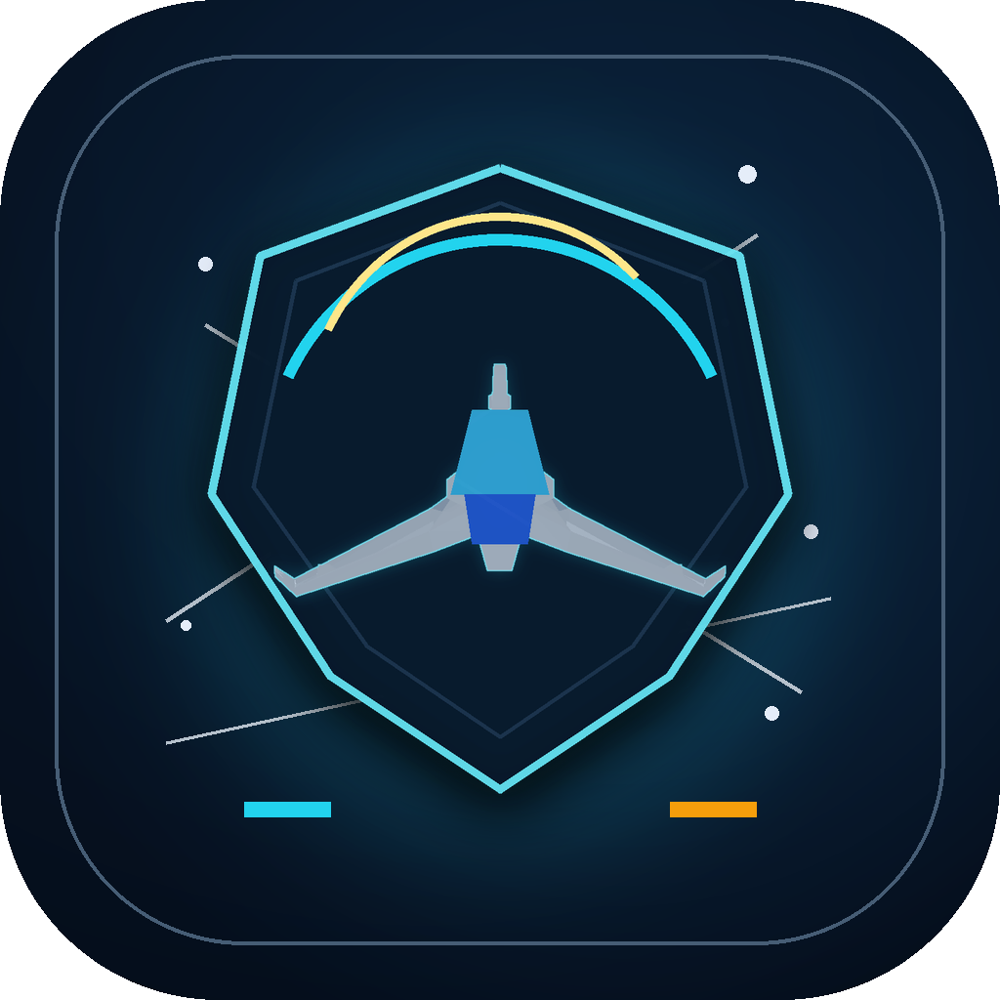
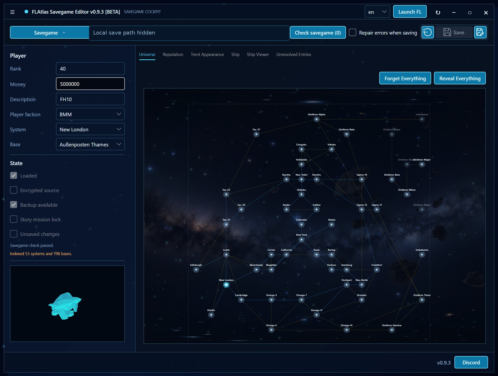
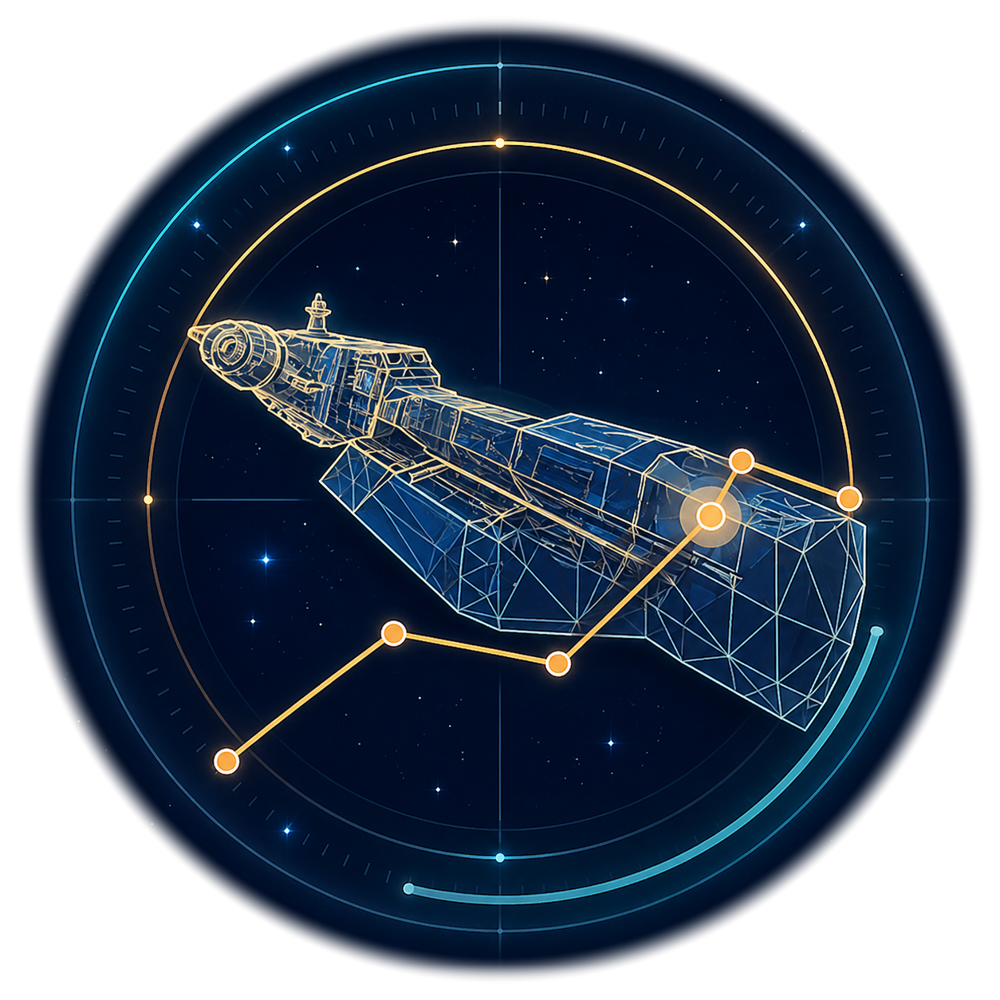
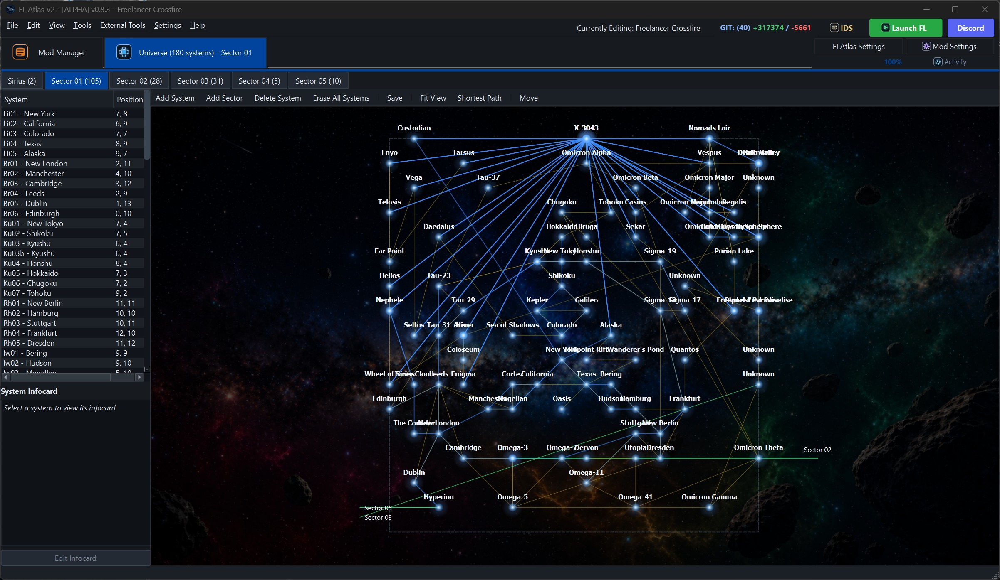

<h1 align="center">flathack</h1>

  I build tools for two worlds: <strong>Freelancer gaming and modding</strong>, and <strong>practical business and IT workflows</strong>.

  <a href="#gaming--freelancer">Gaming &amp; Freelancer</a> ·
  <a href="#business--it">Business &amp; IT</a> ·
  <a href="https://flathack.github.io/">Gaming website</a> ·
  <a href="https://flathack.github.io/business/">Business projects</a>

---

## Gaming & Freelancer

Tools for pilots, modders, and server creators working with Microsoft Freelancer. Explore the [gaming website](https://flathack.github.io/) for browser-based tools, guides, and project updates.

###  FLAtlas Savegame Editor

A mod-aware single-player save editor with backups, validation, encrypted-save support, and game-data lookup. Edit credits, reputation, ship equipment, cargo, and discovered universe state while preserving unknown save entries where possible.

  

[Repository](https://github.com/flathack/FLAtlas---Save-Game-Editor) · [Download v0.9.3](https://github.com/flathack/FLAtlas---Save-Game-Editor/releases/tag/v0.9.3) · [ModDB mirror](https://www.moddb.com/games/freelancer/downloads/flatlas-savegame-editor)

###  FLAtlas V2

A native visual editor for Freelancer universes and systems. Inspect bases, trade lanes, jump connections, and layouts across vanilla and modded installations.

  

[Repository](https://github.com/flathack/FLAtlas-V2) · [Download v0.8.8](https://github.com/flathack/FLAtlas-V2/releases/tag/v0.8.8)

###  FLAtlas Launcher

A desktop launcher for managing Freelancer installations, mods, multiplayer IDs, settings, and companion tools.

[Repository](https://github.com/flathack/FL-Atlas-Launcher) · [Download v1.0.2](https://github.com/flathack/FL-Atlas-Launcher/releases/tag/v1.0.2)

Other gaming projects: [Freelancer 2D](https://github.com/flathack/Freelancer-2D) ([play in your browser](https://flathack.github.io/Freelancer-2D/)) · [FLRocket](https://github.com/flathack/FLRocket) · [FL-Lingo](https://github.com/flathack/FL-Lingo)

### Savegame Editor downloads

| Build | Download |
| --- | --- |
| Windows x64 | [v0.9.3 x64 ZIP](https://github.com/flathack/FLAtlas---Save-Game-Editor/releases/download/v0.9.3/FLAtlas-Savegame-Editor-v0.9.3-windows-x64.zip) |
| Windows ARM64 | [v0.9.3 ARM64 ZIP](https://github.com/flathack/FLAtlas---Save-Game-Editor/releases/download/v0.9.3/FLAtlas-Savegame-Editor-v0.9.3-windows-arm64.zip) |

---

## Business & IT

Tools for Citrix access, Windows support, automation, backups, and everyday desktop work. The [business projects page](https://flathack.github.io/business/) lists the wider collection.

- **[OmaBridge](https://github.com/flathack/OmaBridge)** — launch Citrix StoreFront apps and desktops from the Omarchy bar, with keyring-backed credentials, optional TOTP, and HTML5 sessions. In development; test compatibility with your Citrix environment.
- **[FlatHack ServiceHub](https://github.com/flathack/flathack-servicehub)** — public deployment and operator documentation for a consent-based Windows remote-support pilot. The application source is maintained separately and is not public.
- **[Citrix VDA Upgrade Automation](https://github.com/flathack/Citrix-VDA-Upgrade-Automation)** — reboot-resilient PowerShell orchestration for guarded Windows Citrix VDA upgrades.
- **[AuthFlow](https://github.com/flathack/AuthFlow)** — Windows desktop automation for repeatable web and Citrix sign-in flows.
- **[syncforge](https://github.com/flathack/syncforge)** — Docker-ready pCloud synchronization and backup control with rclone, FastAPI, and React.
- **[PKH/VKH Calculator](https://github.com/flathack/PKH-VKH-Rechner)** — local legal-aid installment calculator based on § 115 ZPO and 2026 allowances.

Desktop utilities: [Omarchy OTP](https://github.com/flathack/omarchy-otp) · [Omarchy Agents Plus](https://github.com/flathack/omarchy-agents-plus) · [AtlasTranslate](https://github.com/flathack/AtlasTranslate) · [PassTypePro](https://github.com/flathack/PassTypePro)

---

Some public repositories contain source code; others are release, issue-tracking, or documentation hubs for work developed separately. Each repository describes its own scope and current status.

[All repositories](https://github.com/flathack?tab=repositories) · [Discord community](https://discord.gg/fY9qweRWGn)
